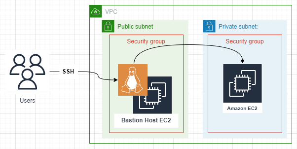
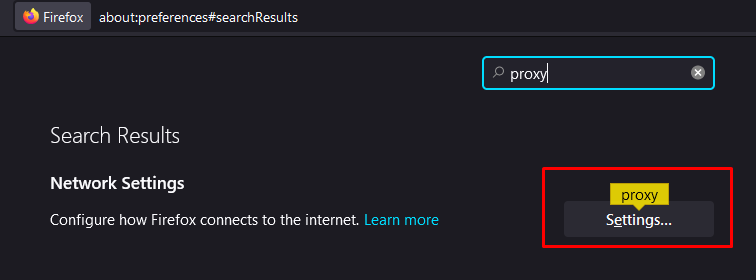
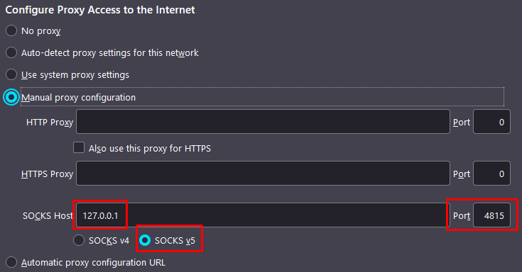
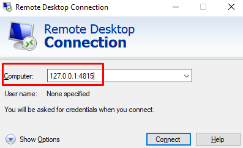

# Bastion Host EC2

A very common way to access AWS resources located in a private subnets is by using a bastion host, which is just an EC2 instance located on a public subnet with a security group attached to allow access only from known sources. The bastion host also has access to the rest of the VPC.

So, to access resources located in private subnets, you must establish a connection to the bastion host, and from the bastion host, make the connection to the resources that you need to access.

Both Windows and Linux are good options for a bastion host, but my preferred way of doing it is using Linux.



This terraform manifest deploy an EC2 instance on a public subnet of your choice and automatically generate a security group to allow the SSH connection to the bastion host from the public IP of the person running the manifest.

## Resources deployed by this manifest:

- Linux EC2.
- Security Group.

## Tested with: 

| Environment | Application | Version  |
| ----------------- |-----------|---------|
| WSL2 Ubuntu 20.04 | terraform | v1.1.2  |
| WSL2 Ubuntu 20.04 | aws-cli | v2.2.12 |

## Initialization How-To:

Located in the root directory, make an "aws configure" to log into the aws account, and a "terraform init" to download the necessary modules and start the backend.

```bash
aws configure
terraform init
```

## Deployment How-To:

### Generate a Key-Pair using AWS-CLI:

```bash
aws ec2 create-key-pair --key-name Bastion-Key --query 'KeyMaterial' --output text > Bastion-Key.pem
```

>:warning: if you use a different key name, change the variable "key_name" in the variables.tf file

Change permissions:
```bash
chmod 400 Bastion-Key.pem
```

Move to home folder:
```bash
mv Bastion-Key.pem ~/.ssh/Bastion-Key.pem
```

>:warning: if you choose a different location, change the variable "local_ssh_key" in the variables.tf file

### Edit the variables.tf file. 

Add your "vpc-id" and "public-subnet-id"

### Deploy:

Located in the root directory, make the necessary changes in the variables.tf file and run the manifests:

```bash
terraform apply
```
## Ways to use your bastion host:

#### SSH Jump:

Instead of SSH into the bastion, and then from the bastion SSH into another Linux box, you can do the "jump" with a one-line command:

```bash
sudo ssh -J -i Bastion-Key.pem ec2-user@11.222.333.444 -i Second-Key.pem ec2-user@192.168.1.123

# Change: 
#   - 11.222.333.444 to the SOCKS port you want to use.
#   - Second-Key.pem to the key of the linux box you want to access.
#   - 192.168.1.123 to the private IP of the linux box you want to access.
```

### SSH Dynamic Port Forwarding:

**Definition**:

>Dynamic port forwarding allows you to create a socket on the local machine (ssh client), which acts as a SOCKS proxy server that you can use in a browser to access web UI applications on the private subnet.

**Example:**
- **Use Case:** You need to access an internal web application located on a private subnet.
- **Solution:** Make a dynamic ssh port forwarding connection to the bastion host, then you configure a proxy socket in firefox and that way you can access the web application using his private IP.

**How-To:**

Make a SSH conection as follows:

```bash
sudo ssh -i Bastion-Key.pem -D 4815 ec2-user@11.222.333.444

# Change 4815 to the SOCKS port you want to use.
#   - 11.222.333.444 to your bastion public IP.
```
>:warning: Use a port that is not in use on either your local machine or the bastion server.

Go to Firefox settings and search for "proxy":



Configure the proxy as follows (Change 4815 to the SOCKS port that you specified in the ssh connection.):



### SSH Local Port Forwarding

>SSH tunneling, or SSH local port forwarding, is a method of transporting arbitrary data over an encrypted SSH connection. SSH tunnels allow connections made to a local port (that is, to a port on your own desktop) to be forwarded to a remote machine via a secure channel.

**Example:**
- **Use Case:** You need to make an RDP connection to an Windows  EC2 instance located on a private subnet.
- **Solution:** Make a ssh local port port forwarding connection to the bastion host, specifying the private IP and RDP port of the Windows instance, plus the local port you want to use for the socket.

**How-To:**

Make a SSH conection as follows:

```bash
sudo ssh -i Bastion-Key.pem -L 4815:192.168.1.123:3389 ec2-user@11.222.333.444

# Change: 
#   - 4815 to the local port you want to use.
#   - 192.168.1.123 to the private IP of the Windows instance you want to access.
#   - 11.222.333.444 to your bastion public IP.
```
>:warning: Use a port that is not in use on either your local machine or the bastion server.

Open your RDP client and make the connection as follows:




## Documentation:

- [Como utilizar un Tunel SSH para dar Soporte Técnico
](https://jmanzur.blogspot.com/2019/07/como-utilizar-un-tunel-ssh-para-dar.html)